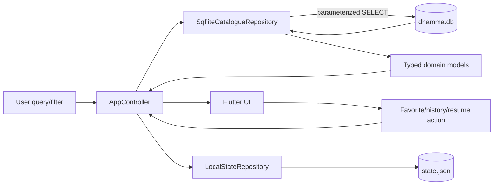

# Catalogue and Library Data Flow

```mermaid
flowchart LR
    Q[User query/filter] --> AC[AppController]
    AC --> R[SqfliteCatalogueRepository]
    R -->|parameterized SELECT| DB[(dhamma.db)]
    DB --> R --> M[Typed domain models]
    M --> AC --> UI[Flutter UI]

    UI --> F[Favorite/history/resume action]
    F --> AC --> S[LocalStateRepository]
    S --> J[(state.json)]
```

The catalogue is never mutated. Personal state is sanitized before an atomic temporary-file rename.
