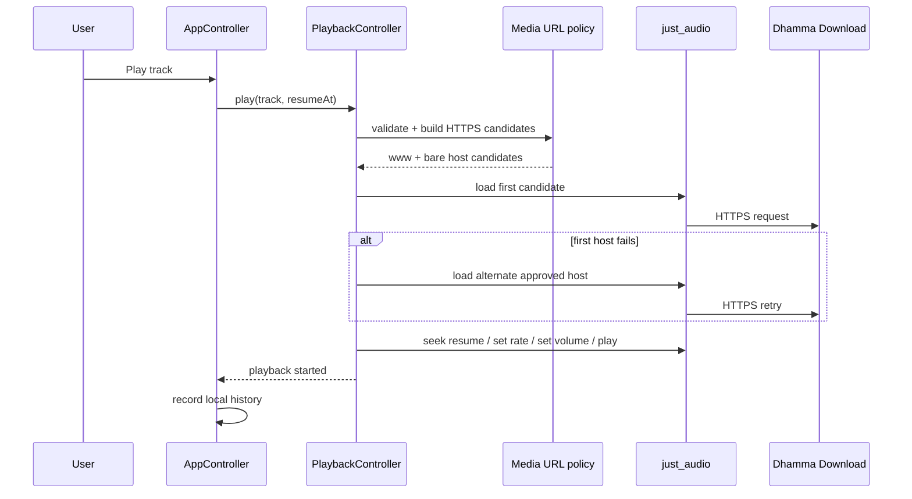

# Playback Sequence

```mermaid
sequenceDiagram
    participant U as User
    participant A as AppController
    participant P as PlaybackController
    participant H as Media URL policy
    participant J as just_audio
    participant D as Dhamma Download

    U->>A: Play track
    A->>P: play(track, resumeAt)
    P->>H: validate + build HTTPS candidates
    H-->>P: www + bare host candidates
    P->>J: load first candidate
    J->>D: HTTPS request
    alt first host fails
      P->>J: load alternate approved host
      J->>D: HTTPS retry
    end
    P->>J: seek resume / set rate / set volume / play
    P-->>A: playback started
    A->>A: record local history
```
