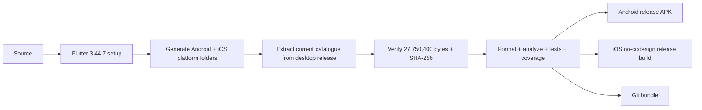

# Build and Release Flow

```mermaid
flowchart LR
    S[Source] --> F[Flutter 3.44.7 setup]
    F --> P[Generate Android + iOS platform folders]
    P --> C[Extract current catalogue from desktop release]
    C --> V[Verify 27,750,400 bytes + SHA-256]
    V --> Q[Format + analyze + tests + coverage]
    Q --> A[Android release APK]
    Q --> I[iOS no-codesign release build]
    Q --> G[Git bundle]
```

The production catalogue gate uses the Git LFS object SHA-256 `d88cfda6d761d0e682dac3bf29ab3b1d7019496a114defe057bfc55a6e746d31` and exact byte length `27,750,400`.
